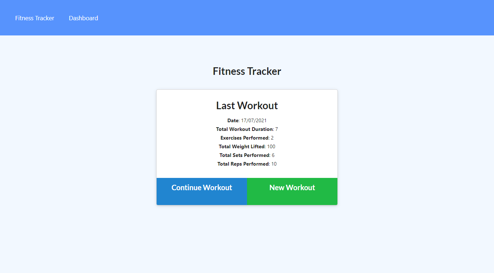
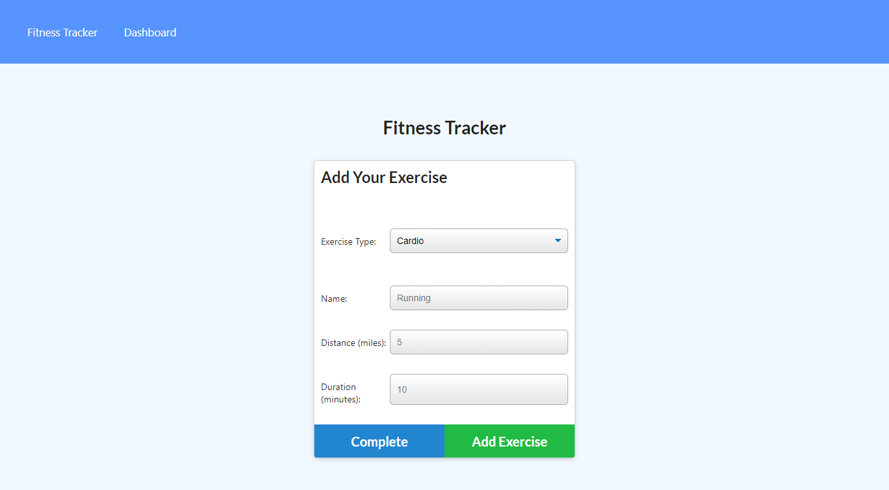
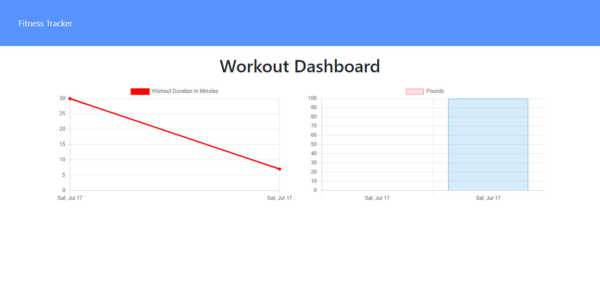

<h1>Otis Fit Tracker</h1>

<h2> Table of Contents </h2>

- [Project Link](#project-link)
- [Getting started](#getting-started)
- [Set up the database](#set-up-the-database)
- [Description](#description)
- [What did we do?](#what-did-we-do)
- [Running the project](#running-the-project)
- [Screenshots](#screenshots)

## Project Link

Click [here](https://guarded-tundra-70978.herokuapp.com/) to view the project on Heroku.

## Getting started

    $ git clone https://github.com/otivisan22/otis-fit-tracker
    $ cd otis-fit-tracker
    $ npm i

## Set up the database

In Robot 3T Workbench

```
DROP DATABASE IF EXISTS workout;

CREATE DATABASE workout;
```

## Description

Our task was to develop the back-end site so that as a user, I want to be able to view create and track daily workouts.
As a user I also want to be able to log multiple exercises in a workout on a given day.
As a user I should also be able to track the name, type, weight, sets, reps, and duration of exercise. As a user and as a cardio lover I should be able to track my distance traveled once I have performed a cardio exercise.

Happy fit workout!
Don't forget also to stretch :rocket: !

## What did we do?

- npm init
- npm i express
- npm i mongoose
- npm i morgan
- npm i nodemon -D

## Running the project

```
$ npm run seed

$ npm run dev
```

## Screenshots




